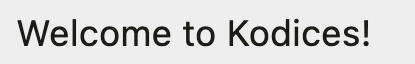
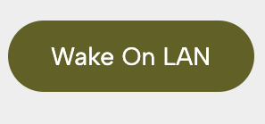
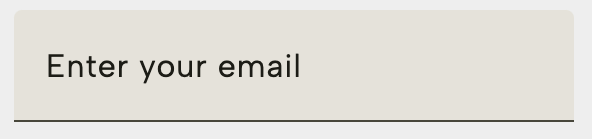
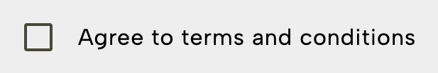

# Kodices Module

This is the core module of the Kodices framework. It is a Kotlin Multiplatform library responsible for parsing JSON definitions into a platform-agnostic UI model.

## Core Concepts

The Kodices framework is built around a few core concepts:

### Element

An `Element` is a platform-agnostic representation of a UI component. It defines the type of the component (e.g., "text", "button", "image") and its properties.

Here is an example of a simple "Text" element defined in JSON:

```json
{
  "type": "text",
  "constants": {
    "text": "Sample text"
  }
}
```

Elements can also have more complex properties, such as styles, actions, and data bindings.

### Action

An `Action` is an operation that can be triggered by an element, usually in response to a user interaction. The base library includes a `MessageAction` for showing simple messages.

Actions are extensible, so you can define your own custom actions to handle navigation, network requests, or any other operation you need.

### DataProcessor

A `DataProcessor` is a component that transforms data. This is a powerful feature that allows you to manipulate data from your server before it is displayed in the UI.

#### JSONDrillerProcessor

This processor is used to "drill down" into a JSON object to extract a specific value.

**Example:**
Given the following data:
```json
{
  "user": {
    "name": "John Doe",
    "email": "john.doe@example.com"
  }
}
```

You can use a `JSONDrillerProcessor` to extract the user's name:
```json
{
  "type": "path",
  "elements": ["user", "name"]
}
```
**Result:** `"John Doe"`

#### StringProcessor

This processor is used to format a string with data.

**Example:**
To create a greeting message, you can use a `StringProcessor`:
```json
{
  "type": "string",
  "elements": "Hello, %"
}
```
When combined with the result of the `JSONDrillerProcessor` above, the final output will be: `"Hello, John Doe"`

#### StylerProcessor

This processor is used to apply simple styling transformations to a string, such as converting it to uppercase or lowercase.

## Customization

Kodices is designed to be extensible. You can add your own custom `Element`s and `Action`s to suit the needs of your application.

### Custom Elements

To create a custom element, you need to define an `ElementDescriptor` and register it with the `KodicesParser`.

**1. Define the ElementDescriptor:**
```kotlin
object CountdownElement : ElementDescriptor {
    override val type = "countdown"
    override val builder = Element.Builder { id, type, attributes, _ ->
        // Your custom element logic here
    }
}
```

**2. Register the ElementDescriptor:**
```kotlin
val kodicesParser = KodicesParser(
    elements = listOf(CountdownElement)
)
```

### Custom Actions

Similarly, you can create custom actions by defining an `ActionDescriptor` and registering it.

**1. Define the ActionDescriptor:**
```kotlin
object WakeOnLANAction : ActionDescriptor {
    override val type = "wol"
    override val builder = Action.Builder { attributes ->
        // Your custom action logic here
    }
}
```

**2. Register the ActionDescriptor:**
```kotlin
val kodicesParser = KodicesParser(
    actions = listOf(WakeOnLANAction)
)
```

## Examples

### Example 1: Simple Text Display

This example demonstrates displaying a simple text element.



```json
{
  "elements": [
    {
      "type": "row",
      "constants": {
        "text": "Welcome to Kodices!"
      }
    }
  ]
}
```

### Example 2: Button with an Action

This example shows how to create a button that triggers a wake-on-LAN action (This assumes you defined the type **WakeOnLAN**, as shown in the sample application). 



```json
{
  "elements": [
    {
      "type": "button",
      "constants": {
        "text": "Wake On LAN"
      },
      "action": {
        "type": "WakeOnLAN",
        "constants": {
          "ip": "192.168.1.100",
          "mac": "00:1A:2B:3C:4D:5E",
          "port": 9
        }
      }
    }
  ]
}
```

### Example 3: Text Input with Validation

This example shows how to create a text input field with validation.



```json
{
  "elements": [
    {
      "type": "textInput",
      "constants": {
        "text": "Enter your email",
        "textSecondary": "Email must be valid"
      },
      "validation": {
        "regex": "[a-z0-9._%+-]+@[a-z0-9.-]+\\.[a-z]{2,}"
      }
    }
  ]
}
```

### Example 4: Checkbox with Text

This example shows how to create a checkbox with associated text.



```json
{
  "elements": [
    {
      "type": "checkbox",
      "constants": {
        "text": "Agree to terms and conditions",
        "active": false
      }
    }
  ]
}
```

### Example 5: Repetitions

This example shows how to create a list from an array.


```json
{
  "elements": [
    {
      "type": "row",
      "constants": {
        "text": "User List"
      }
    },
    {
      "type": "separator",
      "id": "userListSeparator"
    },
    {
      "type": "row",
      "processors": {
        "text": {
          "type": "path",
          "element": "name"
        },
        "textSecondary": {
          "type": "path",
          "elements": [
            "email"
          ]
        }
      },
      "expandWithProcessor": {
        "type": "path",
        "element": "users"
      }
    }
  ]
}
```

Sample data:
```json
{
    "users": [
        {
            "name": "John Doe",
            "email": "john.doe@example.com"
        },
        {
            "name": "Jane Smith",
            "email": "jane.smith@example.com"
        }
    ]
}
```

For a complete example of custom elements and actions, see the `App.kt` file in the `SampleApp` module.
